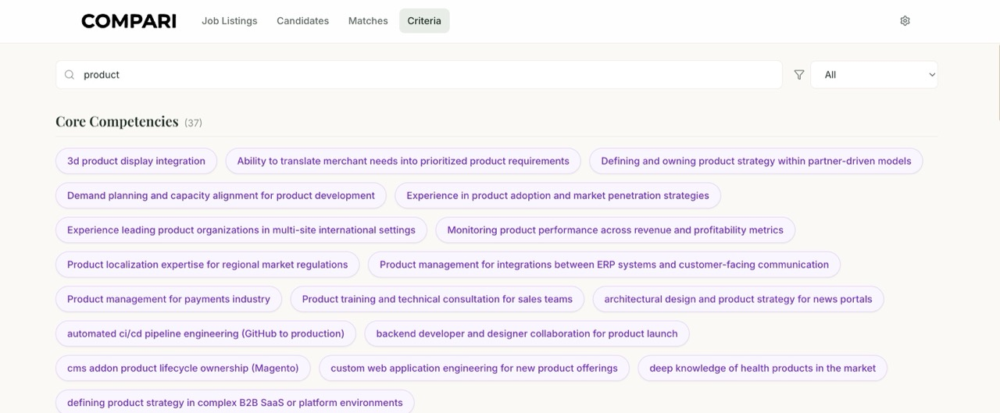
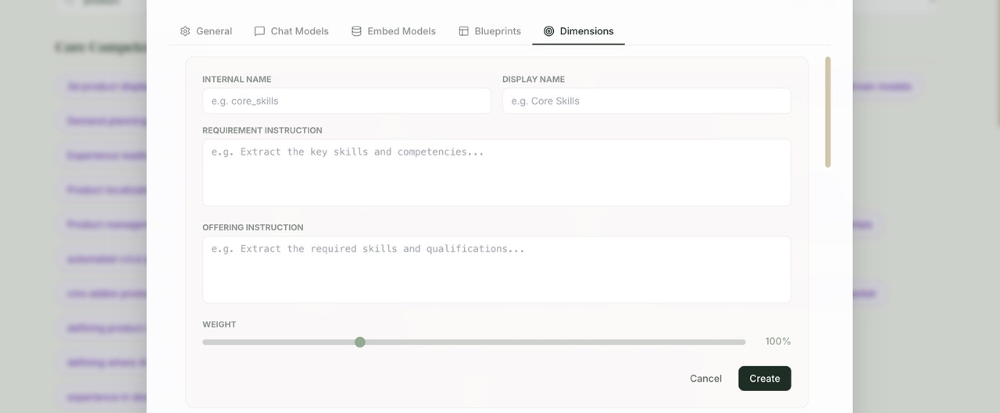
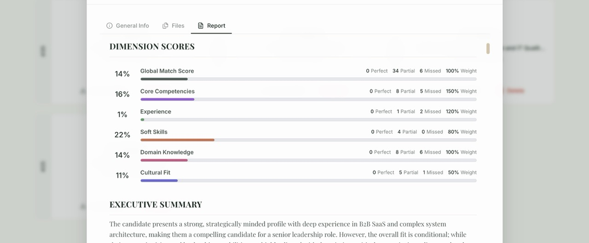
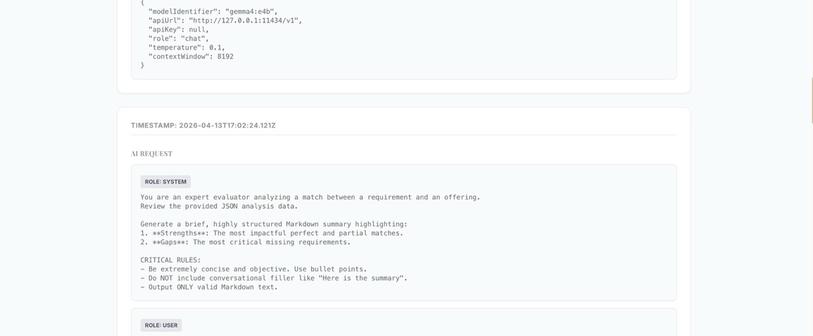
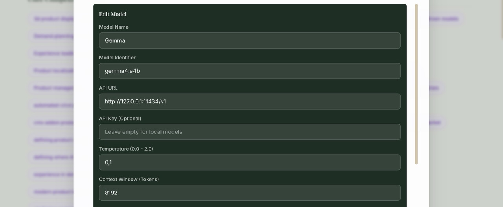
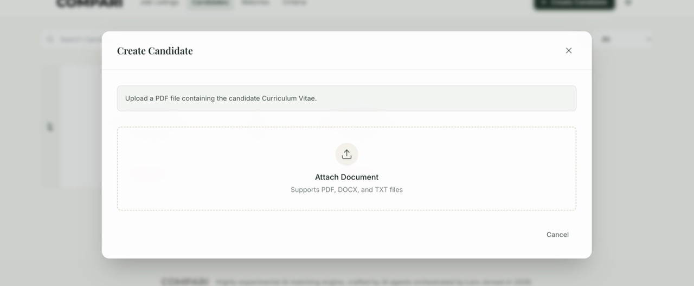

# Compari

A 100% local, AI-powered semantic matching engine and dashboard.

---

## Quick Start & Installation

Compari runs entirely on your local hardware, however you may need a decent laptop as local LLM will tax your system heavily.

Before installing, ensure your system meets the requirements below.

### Prerequisites
**IMPORTANT:** You must have the following installed on your machine:
1. **Node.js** – Download and install from [nodejs.org](https://nodejs.org/).
2. **Ollama** – Download and install from [ollama.com](https://ollama.com/).

After installing Ollama, open your terminal and pull the required local AI models:
```bash
ollama pull gemma4:e4b
ollama pull gemma4:e2b
ollama pull bge-m3
```

### Download

[](https://github.com/larjen/Compari/releases/latest)

### Installation

I have provided automated setup scripts to make installation frictionless:
* **Windows:** Double-click `setup.bat`
* **Mac/Linux:** Run `bash setup.sh` in your terminal.

### Running the App

* **Windows:** Double-click `start.bat`
* **Mac/Linux:** Run `bash start.sh` in your terminal.

Once the server is up and running, the dashboard will become available at **http://localhost:3001**

---

## What does Compari do?

Compari is a highly experimental, privacy-first matching engine. It is designed to analyze the match between **"Requirements"** (e.g., Job Listings, Grants, Project Specs) and **"Offerings"** (e.g., Candidate Resumes, Grant applications, Vendor Proposals) using advanced Artificial Intelligence. 

Instead of relying on rigid keyword matching, Compari "reads" and understands the conceptual meaning of your documents using embedding models to vectorize extracted criteria from the uploaded document.

Each requirement criterion is mathed against a the set of criteria in the offering, and then analyzed to create a match score and a downloadable PDF report.

The math and accuracy of this report should be used with caution, as the math and the process is indeterministic and unverified.

### Core Features

* **Intelligent Entity Extraction:** Upload raw documents (PDF, DOCX, TXT). Compari uses local Large Language Models (LLMs) to read the documents, extract structured metadata, and generate a standardized profile.
* **Semantic Criteria Parsing:** The engine extracts specific, atomic criteria (like soft skills, hard skills, domain knowledge, and cultural fit) based on customizable "Blueprints" and "Dimensions."
* **Vector-Based Matching:** Compari converts these extracted criteria into mathematical vectors (embeddings). It then uses cosine similarity to score matches. This means it knows that a requirement for "Frontend Frameworks" is satisfied by an offering that lists "ReactJS," even if the exact words don't match.
* **Automated Match Reports:** When an Offering is compared to a Requirement, Compari generates a comprehensive, AI-summarized report. It highlights "Perfect Matches," "Partial Matches," and "Missing Requirements," which can be exported directly to PDF.
* **100% Local & Private:** Because Compari uses Ollama to run models like Gemma and Llama directly on your machine, **zero data is sent to the cloud**. Your sensitive resumes, internal job listings, and proprietary documents remain strictly on your hardware.
* **Configurable:** Create own dimensions and blueprints to match your specific needs. This could be for Grants and Applications for grants, or for matching candidates to job listings.

### Screenshots


_Criterias are cast in Domains, and can be compared to eachother using embedding vectors._


_Dimensions can be added to a blueprint, and altered to suit different use cases._


_The match report shows the scores for each dimension, and a summary of the match, it can be downloaded as a PDF document._


_The logs will show you precisely what is being sent to the local model, and what answer the model returns._


_The AI model can be tweaked and replaced, using cloud AI model has not been tested._


_The offering can be created by uploading a PDF document, which will then be placed in queue for processing._

### Caution

There is no guarantee this software works as intended. The calculations and methods are not validated and should be used with caution - install and use at own peril.

---

## Contact & Inquiries

Compari was crafted by AI agents, orchestrated by Lars Jensen in 2026.

[](https://www.linkedin.com/in/larsjensendenmark/)